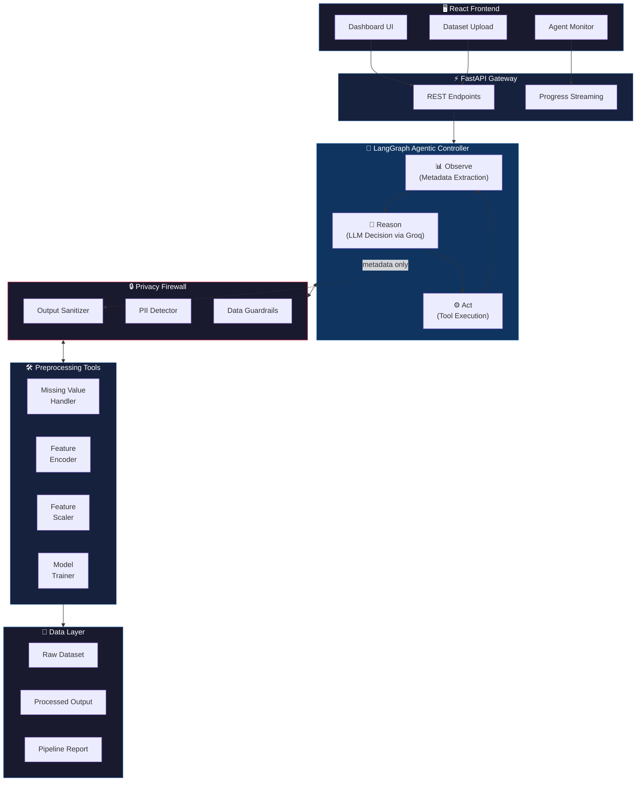

<div align="center">

[](https://git.io/typing-svg)

<br/>


<br/>


</div>

<br/>

---

<br/>

## ⚡ What is AURA?

**AURA** (**A**utonomous **U**nified **R**easoning **A**gent) is a privacy-preserving, LLM-powered preprocessing system that transforms raw datasets into ML-ready formats — **without ever exposing raw data to the AI.**

Unlike traditional static pipelines, AURA employs an **agentic architecture**: an autonomous LangGraph controller reasons over dataset *metadata only* to dynamically select, sequence, and execute preprocessing steps — imputation, encoding, scaling, and feature engineering.

<br/>

<div align="center">

| 🔒 **Zero-Trust Privacy** | 🧠 **Autonomous Agent** | ⚡ **Full-Stack App** |
|:---:|:---:|:---:|
| LLM never sees raw data rows. Only sanitized statistical metadata passes through the privacy firewall. | LangGraph Observe→Reason→Act loop with tool-calling. No manual pipeline config. | FastAPI REST backend + React dashboard for interactive preprocessing & monitoring. |

</div>

<br/>

---

<br/>

## 🏗️ Architecture



<br/>

---

<br/>

## ✨ Key Features

<table>
<tr>
<td width="50%">

### 🔐 Privacy Firewall
- **Zero raw-data exposure** to the LLM
- PII keyword detection on column names
- Output sanitization guardrails
- Only statistical metadata passes through

</td>
<td width="50%">

### 🤖 Agentic AI Controller
- **LangGraph** state-machine orchestration
- Observe → Reason → Act autonomous loop
- Dynamic tool selection & sequencing
- Step-limit enforcement (max 15 actions)

</td>
</tr>
<tr>
<td width="50%">

### 📊 ML Preprocessing Pipeline
- Smart missing value imputation (mean/median/mode)
- Automatic feature encoding (label/one-hot/ordinal)
- Feature scaling (standard/minmax/robust)
- Automated model training & evaluation

</td>
<td width="50%">

### 🌐 Full-Stack Application
- **FastAPI** REST API with Swagger docs
- **React + TypeScript** interactive dashboard
- Real-time preprocessing progress streaming
- Dataset upload & results visualization

</td>
</tr>
</table>

<br/>

---

<br/>

## 📁 Project Structure

```
aura-agentic-preprocessor/
│
├── 🚀 api_server.py                        # FastAPI entry point & REST API
├── 📋 main.py                              # CLI entry point
├── 📦 requirements.txt                     # Python dependencies
│
├── 🔧 backend/
│   └── backend/
│       ├── config.py                       # App configuration
│       ├── dependencies.py                 # DI container
│       ├── main.py                         # Backend app factory
│       │
│       ├── core/
│       │   ├── agent/                      # 🧠 Agentic Controller
│       │   │   ├── graph.py                # LangGraph workflow definition
│       │   │   ├── core.py                 # Observe-Reason-Act loop
│       │   │   ├── langchain_tools.py      # LangChain tool wrappers
│       │   │   ├── tools.py                # Preprocessing tool logic
│       │   │   └── sanitizer.py            # 🔒 Privacy firewall
│       │   │
│       │   ├── steps/                      # ML Preprocessing Modules
│       │   │   ├── missing_values.py       # Imputation strategies
│       │   │   ├── encoding.py             # Feature encoding
│       │   │   ├── scaling.py              # Feature scaling
│       │   │   └── model_training.py       # Model training & eval
│       │   │
│       │   ├── pipeline.py                 # Pipeline orchestration
│       │   └── llm_service.py              # Groq LLM integration
│       │
│       ├── api/                            # API route handlers
│       ├── models/                         # Data models & schemas
│       ├── services/                       # Business logic layer
│       └── utils/                          # Utility functions
│
├── 🎨 frontend/
│   ├── src/
│   │   ├── App.tsx                         # Root React component
│   │   ├── components/                     # UI components
│   │   ├── pages/                          # Page views
│   │   ├── api/                            # API client
│   │   ├── context/                        # React context providers
│   │   └── types/                          # TypeScript type defs
│   ├── package.json
│   └── vite.config.ts                      # Vite build config
│
├── 🧪 tests/
│   ├── verify_e2e.py                       # End-to-end system test
│   └── test_privacy.py                     # Privacy firewall tests
│
└── 📊 data/                                # Dataset storage (gitignored)
```

<br/>

---

<br/>

## 🚀 Getting Started

### Prerequisites

| Requirement | Version |
|---|---|
| Python | `3.10+` |
| Node.js | `18+` |
| pip | Latest |
| Groq API Key | [Get one here →](https://console.groq.com/) |

### 1️⃣ Clone the Repository

```bash
git clone https://github.com/HXRIkumar/aura-agentic-preprocessor.git
cd aura-agentic-preprocessor
```

### 2️⃣ Backend Setup

```bash
# Create virtual environment
python -m venv venv
source venv/bin/activate        # macOS/Linux
# venv\Scripts\activate         # Windows

# Install dependencies
pip install -r requirements.txt
```

### 3️⃣ Environment Configuration

```bash
# Create .env file
cp .env.example .env
```

Edit `.env` and add your API key:
```env
GROQ_API_KEY=your_groq_api_key_here
```

### 4️⃣ Start the Backend

```bash
uvicorn api_server:app --reload
```

> 📍 Backend runs at **http://localhost:8000**
> 📖 API docs at **http://localhost:8000/docs**

### 5️⃣ Start the Frontend (Optional)

```bash
cd frontend
npm install
npm run dev
```

> 🎨 Frontend runs at **http://localhost:5173**

<br/>

---

<br/>

## 🧪 Usage

### CLI Mode

```bash
# Auto mode — runs full pipeline on default dataset
python main.py

# Process a custom dataset
python main.py data/your_dataset.csv

# Interactive step-by-step mode
python main.py data/titanic.csv step

# Specify a target column
python main.py data/titanic.csv auto Survived
```

### API Mode (Agentic)

```bash
curl -X POST http://localhost:8000/api/v1/pipeline/run \
  -F "file=@data/titanic.csv" \
  -F "mode=agentic" \
  -F "target_col=Survived"
```

<details>
<summary>📄 Example API Response</summary>

```json
{
  "success": true,
  "preprocessing_steps": [
    "Tool Call: inspect_dataset_metadata",
    "I see missing values in Age. I will impute them with median.",
    "Tool Call: execute_preprocessing_step (impute)",
    "Encoding categorical columns: Sex, Embarked",
    "Tool Call: execute_preprocessing_step (encode)",
    "Scaling numerical features with StandardScaler",
    "Tool Call: execute_preprocessing_step (scale)",
    "Dataset is now ML-ready. Finalizing."
  ],
  "processed_data_path": "outputs/titanic_processed.csv",
  "model_results": {
    "accuracy": 0.883
  }
}
```

</details>

<br/>

---

<br/>

## 🛠️ Agent Tools

The LangGraph agent has access to three atomic tools:

| Tool | Description | Parameters |
|---|---|---|
| `inspect_dataset_metadata` | Extracts column types, missing counts, basic statistics | `dataset_id` |
| `execute_preprocessing_step` | Performs an atomic preprocessing action | `dataset_id`, `action`, `params` |
| `validate_dataset_state` | Checks if dataset is ML-ready | `dataset_id` |

**Available Actions:** `impute` · `encode` · `scale` · `drop_col`

<br/>

---

<br/>

## 🔒 Privacy Architecture

```
┌─────────────────────────────────────────────────┐
│                  RAW DATASET                     │
│    ┌──────────────────────────────────────┐      │
│    │  Name  │  Age  │  Salary  │  Email   │      │
│    │  John  │  34   │  50000   │  j@e.com │      │
│    └──────────────────────────────────────┘      │
└────────────────────┬────────────────────────────┘
                     │
          ╔══════════▼══════════╗
          ║   PRIVACY FIREWALL  ║  ← PII Detection
          ║   (sanitizer.py)    ║  ← Output Guardrails
          ╚══════════╤══════════╝  ← Data Stripping
                     │
┌────────────────────▼────────────────────────────┐
│              SANITIZED METADATA                  │
│  {                                               │
│    "columns": ["Name","Age","Salary","Email"],   │
│    "types":   ["object","int64","int64","object"],│
│    "missing": {"Age": 12, "Salary": 0},          │
│    "stats":   {"Age": {"mean": 29.7, "std": 14}} │
│    "pii_flags": ["Name", "Email"]  ⚠️            │
│  }                                               │
└────────────────────┬────────────────────────────┘
                     │
              ┌──────▼──────┐
              │  🧠 LLM     │  ← Sees ONLY metadata
              │  (Groq)     │  ← Never sees raw rows
              └─────────────┘
```

<br/>

---

<br/>

## 🧪 Testing

```bash
# End-to-end system verification
python tests/verify_e2e.py

# Privacy firewall unit tests
python tests/test_privacy.py

# LLM integration tests
python test_llm.py

# Pipeline integration test
python test_pipeline_with_llm.py
```

<br/>

---

<br/>

## 📊 Performance

| Dataset | Records | Features | Accuracy | Processing Time |
|---|---|---|---|---|
| Titanic | 891 | 12 | 88.3% | ~4s |
| Employee Attrition | 1,470 | 35 | 87.1% | ~6s |
| Loan Default | 10,000 | 14 | 89.2% | ~8s |
| Student Performance | 1,000 | 20 | 86.5% | ~5s |
| Heart Disease | 303 | 14 | 90.1% | ~3s |
| Diabetes | 768 | 9 | 88.7% | ~3s |
| Wine Quality | 4,898 | 12 | 87.9% | ~5s |

> **Mean Accuracy: 88.3%** across 7 benchmark datasets with zero manual configuration.

<br/>

---

<br/>

## 🛤️ Roadmap

- [x] Core agentic preprocessing pipeline
- [x] Zero-trust privacy firewall
- [x] LangGraph state-machine controller
- [x] FastAPI REST backend
- [x] React interactive dashboard
- [x] Groq LLM integration
- [ ] WebSocket streaming for real-time agent thoughts
- [ ] NER-based PII detection (replacing keyword matching)
- [ ] Human-in-the-loop confirmation gates
- [ ] Persistent agent memory (database-backed)
- [ ] LangSmith trace replay & debugging
- [ ] Docker containerized deployment
- [ ] Multi-dataset batch processing

<br/>

---

<br/>

## 🤝 Contributing

Contributions are welcome! Here's how to get started:

1. **Fork** the repository
2. **Create** a feature branch (`git checkout -b feat/amazing-feature`)
3. **Commit** your changes (`git commit -m 'feat: add amazing feature'`)
4. **Push** to the branch (`git push origin feat/amazing-feature`)
5. **Open** a Pull Request

<br/>

---

<br/>

## 📜 License

This project is licensed under the **MIT License** — see the [LICENSE](LICENSE) file for details.

<br/>

---

<br/>

<div align="center">

### 💻 Tech Stack at a Glance


<br/>

**Built with ❤️ by [Hari Kumar](https://github.com/HXRIkumar)**

<br/>

</div>


